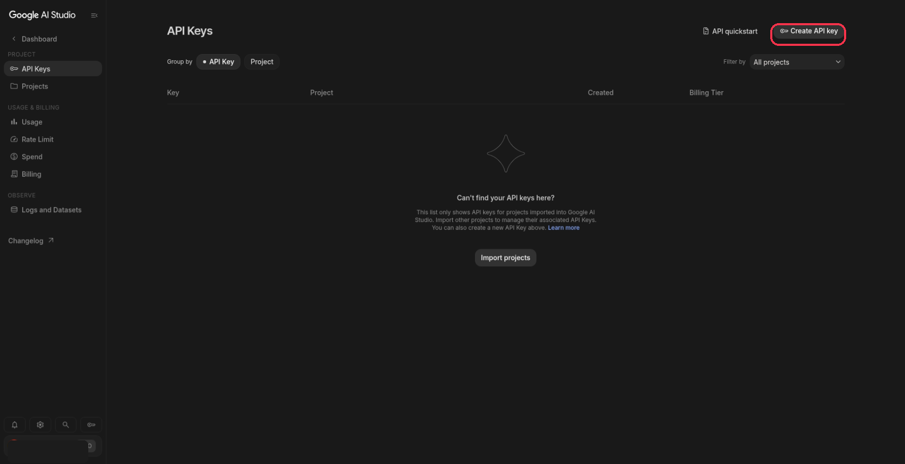
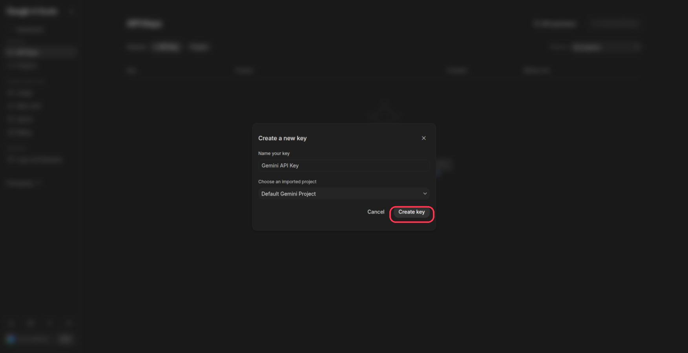
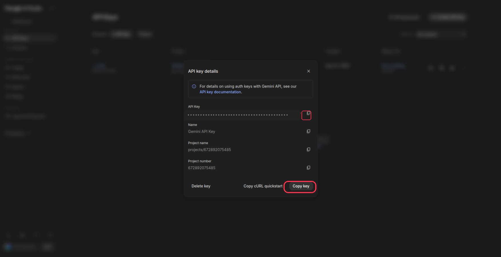
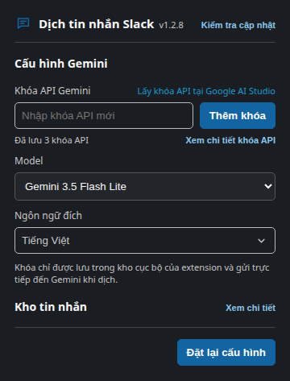

# Translate for Slack

Extension hỗ trợ thu thập và dịch các cuộc trò chuyện trên Slack (channel, tin nhắn trực tiếp và thread) sang ngôn ngữ mong muốn thông qua Google Gemini.

## Tính năng nổi bật

- **Thu thập nội dung linh hoạt**: Hỗ trợ tải và lưu trữ toàn bộ tin nhắn trong channel, tin nhắn trực tiếp (DM) hoặc từng thread riêng biệt.
- **Dịch thông minh qua Gemini**: Tự động dịch nội dung hội thoại với ngữ cảnh tự nhiên dựa trên mô hình Gemini đã chọn.
- **Chế độ dịch đa dạng**:
  - *Dịch toàn bộ đã lưu*: Dịch lại tất cả tin nhắn đã thu thập theo cấu hình hiện tại.
  - *Dịch tin nhắn mới*: Chỉ dịch các tin nhắn mới phát sinh chưa có bản dịch, giúp tối ưu chi phí và thời gian.
  - *Dịch tin nhắn riêng lẻ*: Hỗ trợ dịch nhanh từng tin nhắn cụ thể ngay tại khung chat.
- **Chuyển đổi hiển thị tức thì**: Chuyển đổi qua lại giữa bản dịch và văn bản gốc thuận tiện thông qua nút bấm ngay cạnh tin nhắn.
- **Thu gọn thanh điều khiển**: Hỗ trợ ẩn hoặc hiện cụm nút thao tác trên màn hình để không che khuất nội dung làm việc.
- **Tùy biến cấu hình**: Dễ dàng cài đặt khóa API Gemini, tùy chọn model và ngôn ngữ đích trong popup của extension.
- **Lưu trữ cục bộ an toàn**: Khóa API và dữ liệu bản dịch được lưu trực tiếp trên trình duyệt của bạn, không gửi qua máy chủ trung gian thứ ba.

## Cài đặt và sử dụng

### 1. Cài đặt extension

**Cách 1: Cài đặt nhanh bằng một dòng lệnh (khuyên dùng)**

- Trên Linux hoặc macOS:
  ```bash
  curl -fsSL https://raw.githubusercontent.com/SonNX24042005/translate-for-slack/main/install.sh | bash
  ```

- Trên Windows (PowerShell):
  ```powershell
  irm https://raw.githubusercontent.com/SonNX24042005/translate-for-slack/main/install.ps1 | iex
  ```

*Lệnh trên sẽ tự động tải mã nguồn, sao chép sẵn địa chỉ trang quản lý tiện ích vào bộ nhớ tạm (clipboard) và mở trình duyệt. Thư mục cài mặc định là `~/.local/share/translate-for-slack` trên Linux, `~/Library/Application Support/translate-for-slack` trên macOS và `%LOCALAPPDATA%\translate-for-slack` trên Windows.*

**Cách 2: Cài đặt thủ công**
1. Tải mã nguồn về máy hoặc giải nén tệp zip.
2. Mở trang quản lý tiện ích trên trình duyệt (ví dụ: `chrome://extensions` hoặc `coccoc://extensions`).
3. Bật chế độ dành cho nhà phát triển (Developer mode).
4. Nhấn **Tải tiện ích đã giải nén** (Load unpacked) và chọn thư mục chứa mã nguồn extension.

### Cập nhật tiện ích

Tiện ích kiểm tra phiên bản trên kho công khai mỗi 24 giờ. Khi có phiên bản mới, biểu tượng tiện ích hiện huy hiệu `1` và popup hiển thị số phiên bản, lệnh cập nhật có thể sao chép cùng hướng dẫn mở terminal cho Windows, Linux hoặc macOS. Bạn cũng có thể nhấn **Kiểm tra cập nhật** ở hàng tiêu đề của popup.

- Trên Linux hoặc macOS, mở Terminal từ menu ứng dụng rồi chạy:
  ```bash
  curl -fsSL https://raw.githubusercontent.com/SonNX24042005/translate-for-slack/main/update.sh | bash
  ```
- Trên Windows, nhấn phím Windows, gõ PowerShell, nhấn Enter rồi chạy:
  ```powershell
  irm https://raw.githubusercontent.com/SonNX24042005/translate-for-slack/main/update.ps1 | iex
  ```

Lệnh tự tìm thư mục cài mới hoặc thư mục cài cũ trong Downloads. Bản cài cũ được cập nhật tại chỗ để trình duyệt tiếp tục dùng đúng đường dẫn đã tải. Nếu đã cài bằng Git, lệnh dùng `git pull --ff-only`; nếu cài từ tệp zip, lệnh tải bản zip mới và thay thư mục tiện ích. Sau đó mở trang quản lý tiện ích (`chrome://extensions`, `edge://extensions` hoặc trang tương ứng), nhấn **Tải lại** trên tiện ích và tải lại các trang Slack đang mở. Dữ liệu được lưu trong bộ nhớ trình duyệt sẽ không bị xóa khi tải lại.

Khi phát hành bản mới, hãy tăng `version` trong `manifest.json`, `package.json` và `package-lock.json`; trình kiểm tra dùng giá trị trong manifest để nhận biết bản cập nhật.

### 2. Thiết lập ban đầu

**Bước 1: Lấy khóa API Gemini miễn phí từ Google AI Studio**
1. Truy cập [Google AI Studio](https://aistudio.google.com/app/apikey) và đăng nhập bằng tài khoản Google của bạn.
2. Nhấn nút **Create API key** ở góc trên bên phải trang:
   
3. Trong hộp thoại hiển thị, đặt tên khóa (hoặc để mặc định) rồi nhấn nút **Create key**:
   
4. Nhấn nút **Copy key** (hoặc biểu tượng sao chép) để lưu chuỗi khóa API:
   

**Bước 2: Cấu hình extension**
1. Nhấn vào biểu tượng extension trên thanh công cụ của trình duyệt để mở popup.
2. Dán khóa API vừa sao chép vào ô **Khóa API Gemini** rồi nhấn **Thêm khóa**. Ô nhập sẽ trống để bạn thêm khóa khác (bạn cũng có thể bấm vào dòng *Lấy khóa API tại Google AI Studio* ngay trên giao diện popup để mở trang tạo khóa):
   
3. Chọn một trong sáu model Gemini có sẵn (mặc định: `gemini-3.5-flash-lite`) và thiết lập ngôn ngữ đích cần dịch. Danh sách hiển thị tên bản địa của ngôn ngữ và vẫn tìm được bằng tên tiếng Anh hoặc tiếng Việt. Khi cập nhật lên bản này, lựa chọn model cũ được chuyển một lần sang model mặc định; sau đó bạn có thể chọn lại model khác. Hạn mức RPD theo ảnh được lưu cùng danh sách model trong mã nguồn; hạn mức thực tế có thể thay đổi theo dự án và được xem trong Google AI Studio.

### Nhiều khóa API và bộ đếm RPD

Popup cho phép thêm nhiều khóa API, xóa khóa không còn dùng và xem lượt gửi/giới hạn RPD qua **Xem chi tiết khóa API**. Chọn một khóa trong danh sách để xem RPD của các model thuộc khóa đó. Khóa chỉ được hiển thị dưới dạng đã che. Mỗi lần gửi yêu cầu sẽ tăng bộ đếm cục bộ, kể cả khi yêu cầu thất bại. Khi bộ đếm hoặc Gemini báo một khóa hết RPD của model, tiện ích thử khóa tiếp theo ngay; chỉ báo hết lượt khi mọi khóa đều hết. Trạng thái Gemini báo hết lượt được hiển thị riêng để số lượt đã gửi vẫn chính xác. Bộ đếm đặt lại theo nửa đêm giờ Thái Bình Dương. [Hạn mức Gemini tính theo dự án](https://ai.google.dev/gemini-api/docs/rate-limits), nên các khóa cùng dự án có thể hết lượt cùng lúc.

[Gemini áp hạn mức thực tế theo dự án, không theo từng khóa API](https://ai.google.dev/gemini-api/docs/rate-limits). Vì vậy, nhiều khóa thuộc cùng một dự án vẫn chia sẻ hạn mức của Google; bộ đếm trong tiện ích chỉ phản ánh các yêu cầu đã gửi từ trình duyệt này.

### 3. Sử dụng trên Slack
1. Truy cập Slack trên trình duyệt web.
2. Nhấn nút **Tải và lưu toàn bộ tin nhắn** tại channel hoặc cuộc trò chuyện trực tiếp cần dịch. Đối với từng thread, mở thread và nhấn **Tải và lưu toàn bộ thread**.
3. Nhấn **Dịch toàn bộ đã lưu** hoặc **Dịch tin nhắn mới** để bắt đầu dịch.
4. Nhấn nút **Dịch** / **Bản gốc** tại từng tin nhắn để xem nội dung mong muốn.
